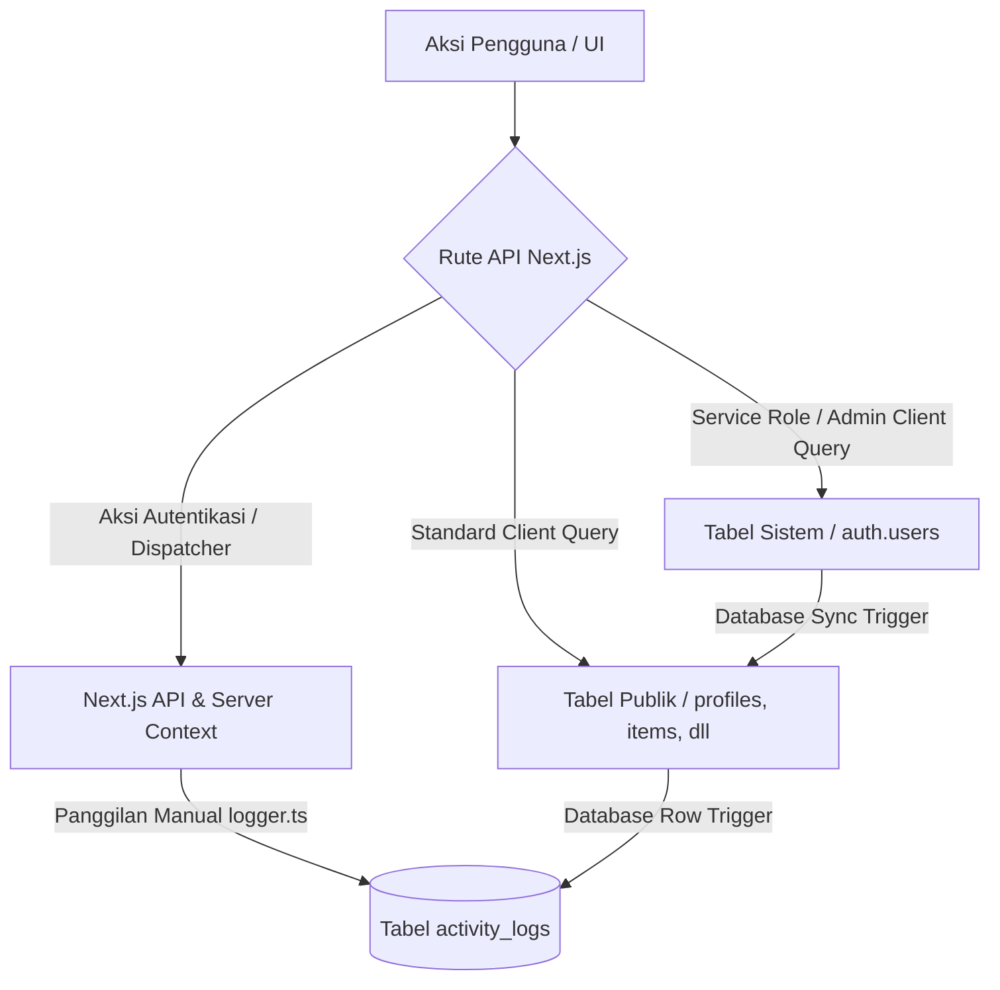

# 📑 Panduan & Dokumentasi Sistem Log Aktivitas (Activity Logs) - Gudang IDN

Dokumen ini menjelaskan arsitektur, cara kerja, dan klasifikasi sistem pencatatan log aktivitas (*activity logs*) pada aplikasi **Gudang IDN**. Dokumentasi ini dirancang agar tim pengembang dapat memahami aliran data pencatatan log, perbedaan perilaku pencatatan aktor (misalnya `System` vs nama Admin), serta daftar lengkap aksi yang direkam di sistem.

---

## 🛠️ 1. Arsitektur Umum Log Aktivitas

Sistem perekaman aktivitas di Gudang IDN menggunakan pendekatan **Hybrid**, yaitu kombinasi antara otomatisasi penuh di tingkat database (**PostgreSQL Triggers**) dan pencatatan manual di tingkat aplikasi (**Next.js Server Actions & API Routes**).



---

## 🔍 2. Penjelasan Kasus Khusus: Log Aktor "System" vs "Admin"

Mengapa aksi **Membuat (CREATE)** dan **Menghapus (DELETE)** user tercatat sebagai **`System`**, sedangkan **Mengubah (UPDATE)** tercatat atas **Nama Admin**?

Berikut analisis alurnya secara mendalam:

### A. Proses Pembuatan & Penghapusan User (`System`)
1. **Pemicu:** Ketika Admin membuat atau menghapus user, Next.js menggunakan **`adminClient` (Service Role)** untuk memodifikasi tabel auth internal Supabase (`auth.users`).
2. **Konteks Transaksi:** API Supabase Auth dijalankan di luar sesi REST standar pengguna. Oleh karena itu, di tingkat sesi PostgreSQL, fungsi pembantu **`auth.uid()`** bernilai `null` (tidak ada user ter-autentikasi yang terikat langsung ke koneksi database tersebut).
3. **Eksekusi Trigger:** Trigger sinkronisasi database menyalin data dari `auth.users` ke `public.profiles`. Karena `auth.uid()` kosong (`null`), trigger log di database secara default mencatat pelaku aksi sebagai `null` (di UI diterjemahkan sebagai **System**) dan mencatat IP/User-Agent dengan string **`System/Cron`**.

### B. Proses Pengubahan User (`Nama Admin`)
1. **Pemicu:** Ketika Admin memperbarui detail profil user lain (nama, role, no telp), Next.js memanggil client **`supabase` standar** (bukan adminClient) untuk langsung meng-update tabel `public.profiles`.
2. **Konteks Transaksi:** Kueri update ini membawa token JWT Admin yang aktif di browser. PostgreSQL mengenali sesi ini sehingga fungsi `auth.uid()` sukses mengembalikan ID Admin tersebut.
3. **Eksekusi Trigger:** Trigger database membaca ID Admin dari sesi transaksi dan mencatatnya ke dalam kolom `user_id` di `activity_logs`, sehingga nama Admin asli muncul di halaman log admin.

---

## 📊 3. Daftar Lengkap Aksi & Entitas Log Aktivitas

Berikut adalah tabel klasifikasi lengkap aksi yang terekam di aplikasi **Gudang IDN**:

| Entitas (*Entity Type*) | Aksi (*Action*) | Deskripsi Aktivitas | Kategori Pencatatan | Konteks Pelaku (*Actor*) |
| :--- | :--- | :--- | :--- | :--- |
| **USER** (Pengguna) | `CREATE` | Menambahkan pengguna baru ke sistem | **Full DB Trigger** (via `auth.users`) | 🖥️ `System` / `System/Cron` |
| **USER** (Pengguna) | `DELETE` | Menghapus pengguna dari sistem | **Full DB Trigger** (via `auth.users`) | 🖥️ `System` / `System/Cron` |
| **USER** (Pengguna) | `UPDATE` | Mengedit info profil atau mengubah role user | **DB Trigger + Next.js Help** | 👤 Admin yang sedang login |
| **ITEM** (Barang) | `CREATE` | Menambah barang baru ke database gudang | **DB Trigger + Next.js Help** | 👤 Admin / Staff yang login |
| **ITEM** (Barang) | `UPDATE` | Mengubah nama, kategori, status, atau kondisi barang | **DB Trigger + Next.js Help** | 👤 Admin / Staff yang login |
| **ITEM** (Barang) | `DELETE` | Menghapus barang dari database | **DB Trigger + Next.js Help** | 👤 Admin / Staff yang login |
| **WAREHOUSE** (Gudang) | `CREATE`, `UPDATE`, `DELETE` | Mengelola data lokasi/kantor cabang gudang | **DB Trigger + Next.js Help** | 👤 Admin yang sedang login |
| **STOCK_IN** (Barang Masuk) | `CREATE`, `UPDATE`, `DELETE` | Mencatat transaksi masuk/restock barang ke gudang | **DB Trigger + Next.js Help** | 👤 Admin / Staff yang login |
| **STOCK_OUT** (Barang Keluar)| `CREATE`, `UPDATE`, `DELETE` | Mencatat transaksi keluar barang non-pinjam | **DB Trigger + Next.js Help** | 👤 Admin / Staff yang login |
| **STOCK_TRANSFER** (Mutasi) | `CREATE` | Memindahkan stok barang dari satu gudang ke gudang lain | **DB Trigger + Next.js Help** | 👤 Admin / Staff yang login |
| **STOCK_OPNAME_GROUP** | `CREATE`, `UPDATE` | Melakukan dan merampungkan audit fisik barang (Opname) | **DB Trigger + Next.js Help** | 👤 Admin yang sedang login |
| **LOAN_REQUEST** (Peminjaman)| `CREATE` | Anggota mengajukan permintaan peminjaman barang | **DB Trigger + Next.js Help** | 👤 Nama Anggota (peminjam) |
| **LOAN_REQUEST** | `APPROVE` / `REJECT` | Admin menyetujui atau menolak permohonan pinjam | **DB Trigger** (Deteksi status DB) | 👤 Admin yang menyetujui |
| **LOAN_REQUEST** | `LOAN` | Status berubah menjadi aktif (barang diserahkan) | **DB Trigger** (Deteksi status DB) | 👤 Admin yang memproses |
| **LOAN_REQUEST** | `RETURN` | Anggota mengembalikan barang ke gudang | **DB Trigger** (Deteksi status DB) | 👤 Admin/GA yang menerima |
| **LOGIN** | `LOGIN` | Pengguna berhasil masuk ke sistem | **Manual Next.js API Route** | 👤 Pengguna bersangkutan |
| **REMINDER** (WhatsApp) | `REMINDER` | WhatsApp bot berhasil mengirimkan pesan notifikasi otomatis | **Manual Next.js API (Cron)** | 🖥️ `System/Dispatcher` |

---

## ⚙️ 4. Panduan Kustomisasi & Perbaikan Log (Masa Depan)

Jika di masa mendatang Anda ingin agar aksi **Membuat** dan **Menghapus** user mencatat nama Admin (bukan `System`), Anda dapat menerapkan salah satu dari alternatif berikut:

### Opsi A: Memanfaatkan Logging Manual di Next.js (Disarankan)
1. Buat pengecualian di Trigger Database (PostgreSQL) agar tidak merekam `INSERT` atau `DELETE` otomatis pada tabel `profiles`.
2. Lakukan perekaman log manual di Next.js API Routes dengan memanggil helper `createActivityLog` dari `@/lib/logger` setelah operasi `adminClient` selesai.

*Contoh di `app/api/admin/users/route.ts` (Aksi CREATE):*
```typescript
import { createActivityLog } from '@/lib/logger'

// Setelah adminClient.auth.admin.createUser dan update profile berhasil:
await createActivityLog({
  action: 'CREATE',
  entityType: 'USER',
  entityId: newUser.user.id,
  details: {
    name: full_name,
    new_data: { id: newUser.user.id, role, full_name, email }
  }
})
```

---

*Dokumentasi ini diperbarui secara berkala mengikuti perkembangan sistem audit log Gudang IDN.*
